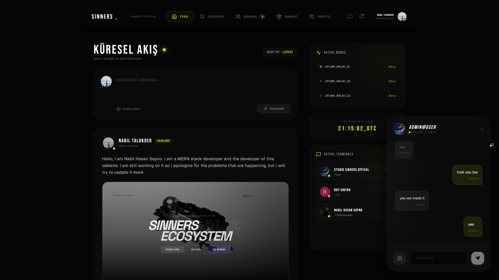

# Sinners. Tech - Frontend Application 🚀

Welcome to the frontend repository of the **Sinners. Tech** web platform. This is a high-performance, next-generation e-commerce and community platform built tailored explicitly to custom keyboards, artisan keycaps, and premium tech peripherals.

## 🌟 Features 

### 🛒 E-Commerce & Storefront
- **Dynamic Product Showcases:** Seamless presentation of custom keyboards, keycaps, and switches using a highly stylized UI.
- **Product Filtering & Categories:** Easily browse through various specialized collections.
- **Cart & Checkout Flow:** Managed cart system to handle items and ready users for transactions.

### 🌐 Social Network & Community Hub
- **Global Discovery:** Discover and follow other enthusiasts in the custom tech community.
- **Post & Feed Ecosystem:** Create, view, delete, and interact with community posts directly in the app.
- **Direct Messaging (Uplink):** Real-time global messaging and chat support using Socket-based real-time features.
- **Custom Cyberpunk Profiles:** Detailed user profiles tracking locations, biographies, and account stats inside visually stunning glass-morphic layouts.

### 🔒 Security & Authentication
- **NextAuth Integration:** Bulletproof authentication providing both Credential (Email/Password) AND Google OAuth login options.
- **Roles & Permissions:** Secure separation for standard users and Admin (Dashboard Access).

### 🎛️ Admin Dashboard
- **Content Management:** Admins can insert/update/delete products, keycaps, and keyboards.
- **Media Optimization:** Direct Cloudinary uploads from the frontend ensure fast and optimized media storage.
## 🖥️ Desgin Screenshot

## 🖥️ Desgin Screenshot


## 🛠️ Technology Stack

The project relies on state-of-the-art modern web technologies:

- **Framework:** [Next.js](https://nextjs.org/) (App Router format for server-side generation & performance)
- **Library:** [React](https://reactjs.org/) (v18+)
- **Styling:** 
  - [Tailwind CSS](https://tailwindcss.com/) (For utility-first rapid layouts)
  - [SCSS Modules](https://sass-lang.com/) (For highly structured, component-level custom scoping)
  - CSS Variables & Glassmorphism Design System
- **Animation:** [Framer Motion](https://www.framer.com/motion/) (For buttery smooth interactions, loaders, and layout transitions)
- **UI Components & Icons:** 
  - Sub-components from [Shadcn UI](https://ui.shadcn.com/)
  - Icons from [Lucide React](https://lucide.dev/)
- **Authentication:** [NextAuth.js](https://next-auth.js.org/)
- **Media Hosting & Storage:** [Cloudinary API](https://cloudinary.com/) (Using unsigned preset uploads)
- **API Fetching:** [Axios](https://axios-http.com/) / Native Next.js Fetch API

## ⚙️ Environment Configuration

To run the application locally, you will need the following Environment Variables set inside your `.env.local` file:

```env
# Authentication Secrets
AUTH_SECRET="your_nextauth_secret"
GOOGLE_CLIENT_ID="your_google_cloud_client_id"
GOOGLE_CLIENT_SECRET="your_google_cloud_client_secret"

# Backend Endpoints
NEXT_PUBLIC_API_URL="http://localhost:8000" # OR Your Production Backend URL

# Cloudinary Setup
NEXT_PUBLIC_CLOUDINARY_CLOUD_NAME="your_cloud_name"
NEXT_PUBLIC_CLOUDINARY_UPLOAD_PRESET="your_unsigned_preset_name"
```

## 🚀 Getting Started

First, ensure you have Node.js and NPM/Yarn installed. 

**1. Install Dependencies:**
```bash
npm install
```

**2. Start the Development Server:**
```bash
npm run dev
```

Open [http://localhost:3000](http://localhost:3000) with your browser to see the result. The application supports Hot-Module-Replacement (HMR) for ultra-fast local development iterations.

## 🎨 Design Philosophy
*"Premium, High-Fidelity & Alive."*
The interface blends dark themes `#050505` `#131313` with vibrant highlights like `Neon Lime (#D9FF00)` and `Indigo-500`. It strategically utilizes fonts such as *Bebas Neue*, *Space Grotesk*, and *JetBrains Mono* to invoke a specialized "tech/cyberpunk" immersive feeling.
